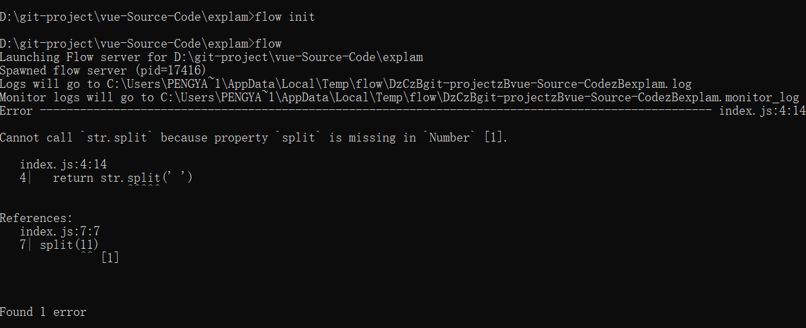
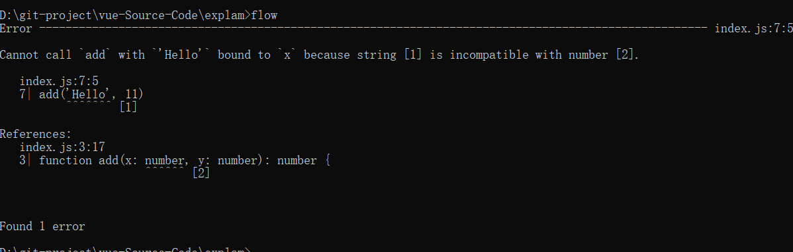

### flow的作用
	因为 Babel 和 ESLint 都有对应的 Flow 插件以支持语法，可以完全沿用现有的构建配置，
	非常小成本的改动就可以拥有静态类型检查的能力。
	
	

>npm install -g flow-bin
>flow init


### Flow 的工作方式

```javascript
<!-- 类型推断 -->
/*@flow*/

function split(str) {
  return str.split(' ')
}

split(11)
```




```javascript
<!-- 类型注释 -->
/*@flow*/

function add(x: number, y: number): number {
  return x + y
}

add('Hello', 11)
```



```javascript
<!-- 类和对象 -->
/*@flow*/

class Bar {
  x: string;           // x 是字符串
  y: string | number;  // y 可以是字符串或者数字
  z: boolean;

  constructor(x: string, y: string | number) {
    this.x = x
    this.y = y
    this.z = false
  }
}

var bar: Bar = new Bar('hello', 4)

var obj: { a: string, b: number, c: Array<string>, d: Bar } = {
  a: 'hello',
  b: 11,
  c: ['hello', 'world'],
  d: new Bar('hello', 3)
}

```

```javascript
<!-- 类和对象 -->
/*@flow*/

class Bar {
  x: string;           // x 是字符串
  y: string | number | void;  // y 可以是字符串或者数字
  z: boolean;

  constructor(x: string, y: string | number | void) {
    this.x = x
    this.y = y
    this.z = false
  }
}

var bar: Bar = new Bar('hello', 4)

var obj: { a: string, b: number, c: Array<string>, d: Bar } = {
  a: 'hello',
  b: 11,
  c: ['hello', 'world'],
  d: new Bar('hello', 3)
}

```

```javascript
/*@flow*/

var foo: ?string = null

//此时，foo 可以为字符串，也可以为 null。
```

### Flow 在 Vue.js 源码中的应用
有时候我们想引用第三方库，或者自定义一些类型，但 Flow 并不认识，因此检查的时候会报错。为了解决这类问题，
Flow 提出了一个 libdef 的概念，可以用来识别这些第三方库或者是自定义类型，而 Vue.js 也利用了这一特性。

在 Vue.js 的主目录下有 .flowconfig 文件， 它是 Flow 的配置文件，感兴趣的同学可以看官方文档。这其中的
 [libs] 部分用来描述包含指定库定义的目录，默认是名为 flow-typed 的目录。

这里 [libs] 配置的是 flow，表示指定的库定义都在 flow 文件夹内。我们打开这个目录，会发现文件如下：

```
flow
├── compiler.js        # 编译相关
├── component.js       # 组件数据结构
├── global-api.js      # Global API 结构
├── modules.js         # 第三方库定义
├── options.js         # 选项相关
├── ssr.js             # 服务端渲染相关
├── vnode.js           # 虚拟 node 相关
```

### 总结

这种静态类型检查的方式非常有利于大型项目源码的开发和维护。