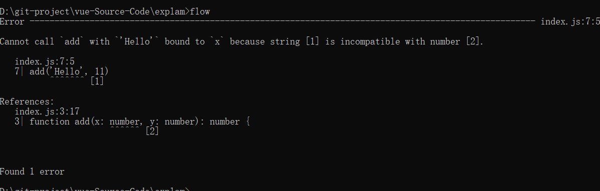

### flow的作用
	因为 Babel 和 ESLint 都有对应的 Flow 插件以支持语法，可以完全沿用现有的构建配置，
	非常小成本的改动就可以拥有静态类型检查的能力。
	
	

>npm install -g flow-bin
>flow init


### Flow 的工作方式

```javascript
/*@flow*/

function split(str) {
  return str.split(' ')
}

split(11)
```


```javascript
/*@flow*/

function add(x: number, y: number): number {
  return x + y
}

add('Hello', 11)
```

